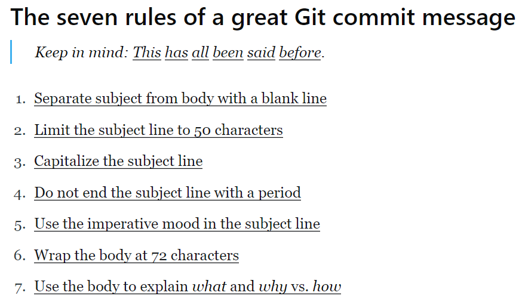

# Best Pratices Git

last update : 27/10/2021

## **1 - Don't ```git push ``` straight to master**

-> keep your code safe and deployable any time.

Description :

<p style="text-align:justify;"> Use the concept of "cheap branching". Use different branch promote the collaboration, and allow to ignite heathly discussions, improve
codebase quality and spread the knowledge with others developers (Code Review).</p>

```
git branch -b <name> master // create new branch from master

git checkout - //switch back to the previous branch
```

### **1.1 - Use the branch naming convention**

<p style="text-align:justify;">Adopting a consistent branch naming conversion is essential to keeping your repository. The most popular ones is "git flow".</p>


[](https://nvie.com/posts/a-successful-git-branching-model/)

* Use separators like - or _ when you create a new branch
* Don't use only numbers
* Avoid too long names
* Avoid the use of all naming conventions
## **2 - Don't commit the code as an unregognized author**

Description :

<p style="text-align:justify;"> Use for keep a trace of the development, who develop what. Example, it's possible to use the command :</p>

```
git blame <file>
```

### **2.1 - write descriptive and meanungful commit messages**



Apply the **SOLID** concept -> S -> Single Responsibility Principle.

push the least amount of lines that make sens together.

Make atomic commit. An Anatomic commit = one commit for one change.

## **3 - Define code owners for faster code reviews**

Use the *Code Owners* feature to define which teams and people are automatically selected as reviewers.

link to doc [](https://docs.github.com/en/repositories/managing-your-repositorys-settings-and-features/customizing-your-repository/about-code-owners)

## **4 - Don't leak secrets into source control**

Secrets : account passwords, API keys, private tokens, SSH Keys ...

Possiblity to use **Hashicorp Vault** or **AWS Secrets Manager**

If you want check your repository, you have the possibility to use tools for scanning secrets and prevent attack or theth data.

* Git-secrets : identify in your code
* Git hooks : can be used to build a pre-commit hook and check every pull request for secrets

Available on the web.

## **5 - Don't commit dependencies or local config files**

If you push your project dependencies on your remote repository, it will be increase your repository size.
For the config files, the best way is to defne the elements on your ```.gitignore```.

link to doc [](https://www.toptal.com/developers/gitignores)

## **6 - Archive dead repositories**

## **7 - Lock package versions**

## **8 - Specify standard package versions**

## **9 - Levrage task list**

Way for the *totrack to-dos* in ```.md```  files. The Tasks lists provide an excellent way to capture a high-level overview of a task or issue.

## **10 - Keep branches up to date**

You pull from remote, hit merge and suddently you're faced with a barrage of merge conflicts.
The best practice here is to ensure that you’re consistently merging your base branch into your current branch as you work, especially if it’s a long-outstanding branch.

## **11 - Enable security alerts**

Possibility to track reported security vulnerabilities in some dependencies and will even suggest fixes for your projects.
[](https://docs.github.com/en/code-security/supply-chain-security/managing-vulnerabilities-in-your-projects-dependencies/about-alerts-for-vulnerable-dependencies)

## **12 - Rebase your working branch frequently**

```
git checkout <upstream_branch>

git pull

git checkout -

git rebase <upstream_branch>
```

or

```
git fetch --prune
```

## **13 - Review your commit**

Make code review, possibility to use GitHub pull request model.

## **14 - Keep your codebase healthy**

```
git-gc  // clean the unwanted files and optimizes your local repository

git-prune // prune all unreachable objects
```

## **15 - Code Review**

This command takes two inputs and shows differences.

```
git diff --staged
```

## **16 - Git Branch**

* use different branches
* use branch naming convention
* delete stale branches (stale = no stable)
* keep your branches up to date
* protect your main branch
* test before push
* use group word in the branch name
  * wip -> work in progress
  * exp -> experimental branch (dev)
  * feature -> adding new feature

## AFTER Technique

Regroup the most important "Best Practices" :

* A - Atomic Commits

* F - Frequent Commits

* T - Test before you push your changes

* E - Enforce standards

* R - Refactoring is not a new feature

## Git Flow principles

### Create specific branch

* main : main branch
* develop : branch for the development (complete with all files and repositories)
* feature : branch for the realization of new features on the project
* release : branch for the deploy
* hotfix : branch for fix bugs


### Global Workflow

* main 
    * > develop
* develop
    * > release
    * > feature

**When merge**

* feature 
    * > develop
* release 
    * > develop
    * >main

**When Hotfix**

* main 
    * > hotfix
* hotfix 
    * > main
    * > develop
### Example with developp and feature branch

```
git checkout main
git checkout -b develop
git checkout -b feature_branch

# work happens on feature branch

git checkout develop
git merge feature_branch
git checkout main
git merge develop
git branch -d feature_branch
```

### Example with hotfix

```
git checkout main
git checkout -b hotfix_branch
# work is done commits are added to the hotfix_branch
git checkout develop
git merge hotfix_branch
git checkout main
git merge hotfix_branch
```

## conflicts Management

```
git pull --rebase origin <branch>
```

-- rebase : move all commits to the <branch> branch pointer.

if error

```
git reset HEAD <some-file> |  git add/rm <some-file>
git rebase --continue // if mistake, use --abort
```

## Workflow branches

```
git checkout main
git fetch origin
git reset --hard origin/main
```

### Create new branch

```
git checkout -b new-feature main
```

### Update the branch new-features

```
git status
git add <some-file>
git commit
git push -u origin new-feature
```

## Useful commands

```
git log

git blame

git cherry-pick

git diff

git apply

git stash save <message>

git bisect

git fetch // git pull --force

git fetch <remote> <branch> // force overwrite Local Files

git push -u | --set-upstream origin <branch> // push a local branch to remote repository and allow the track

git push --force | -f <branch> // rewrite the history

git rebase -i // remove branch history

git pull --rebase // update your local working branch, rewrite history , avoid a merge commit

git log --oneline --graph --color --all --decorate // display the tree
```

### Accidentally commited to the wrong branch

```
git checkout <branch name>
git merge master
git push
git reset --hard // fix the other branch, change the pointer of the branch
```

## Go further

* [Git flow tool](https://github.com/nvie/gitflow)

## Sources

**Keywords** : best pratice to create another branch git

* [Datree](https://www.datree.io/resources/github-best-practices)
* [Raygun](https://raygun.com/blog/git-workflow/)
* [sourcelevel.io](https://sourcelevel.io/blog/7-git-best-practices-to-start-using-in-your-next-commit)
* [Acompiler](https://acompiler.com/git-best-practices/)
* [GitHub-Doc](https://github.com/git-guides/git-add)
* [Atlissian-WorkFlow](https://www.atlassian.com/fr/git/tutorials/comparing-workflows)
* [Atlissian-Branch](https://www.atlassian.com/fr/git/tutorials/comparing-workflows/feature-branch-workflow)
* [Atlissian-GitFlow](https://www.atlassian.com/fr/git/tutorials/comparing-workflows/gitflow-workflow)
* [LinuxHint](https://linuxhint.com/git_merge_branch_git_delete_branch/)

[](https://stackoverflow.com/questions/24717208/git-what-is-the-best-practice-for-team-work-on-a-feature-branch) [](https://stackoverflow.com/questions/4470523/create-a-branch-in-git-from-another-branch)


